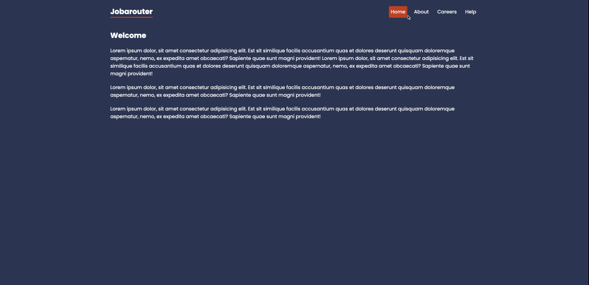

# job-router

This is a project to manipulate React Router.

- So, firstly, I used RouterProvider to provide router to my app.
- Second, I used the Outlet component. This component will be responsible for telling the router where I want to display my content.
- Third, I created a custom 404 page to catch my errors when the link is not found.
- To load data into a component before it renderes in the browser I used Loaders.

# Technologies 🏷️

